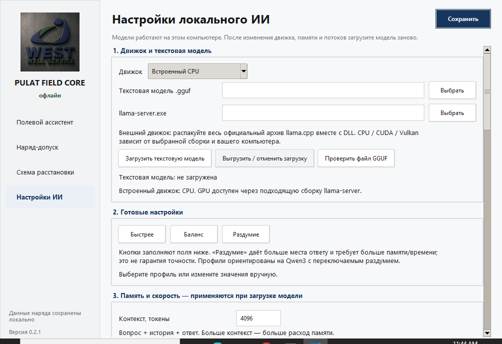
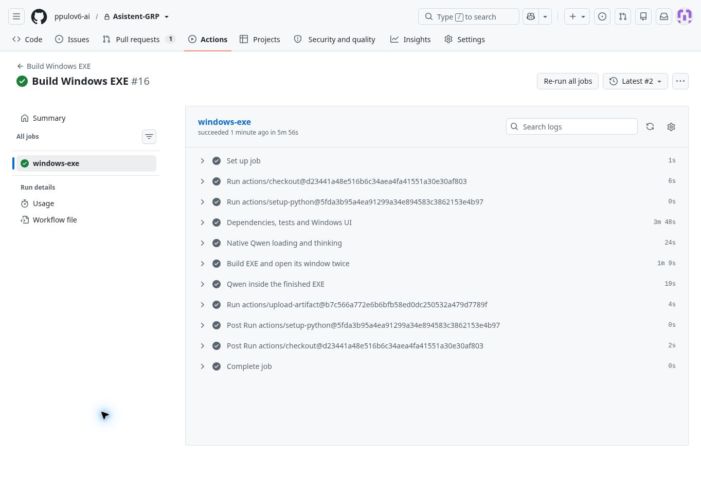

  

<h1 align="center">Пулат Сафаров</h1>

  ИИ-автоматизация · RAG-ассистенты · Telegram-боты · нефтесервис

  <a href="https://t.me/PulatSafarov">Telegram</a> ·
  <a href="https://marketplace.zerocoder.ru/zerocoder/21676">Портфолио Zerocoder</a> ·
  <a href="https://www.fl.ru/users/safarovpulat362/portfolio/">FL.ru</a> ·
  <a href="https://kwork.ru/user/safarovpulat362">Kwork</a>

## Обо мне

Я Пулат Сафаров — руководитель и разработчик прикладных ИИ-инструментов для нефтесервиса и бизнеса. Беру реальную рабочую задачу, собираю логику, подключаю ИИ и упаковываю результат так, чтобы им можно было пользоваться в поле или в офисе.

## Чем занимаюсь

- ИИ-ассистенты и RAG-поиск по документам;
- Telegram-боты и автоматизация процессов в n8n;
- интеграции с LLM через API, структурированные ответы и проверки;
- веб- и desktop-инструменты на Python;
- отраслевые решения для ГРП: анализ данных, подготовка программ и работа со знаниями.

## Технологии

`Python` · `FastAPI` · `n8n` · `OpenAI-compatible API` · `RAG` · `ChromaDB` · `Weaviate` · `Pinecone` · `Docker` · `GitHub` · `Telegram`

## Реальный интерфейс

### Pulat Field Core Personal

Рабочий desktop-интерфейс: настройки локальных модулей, модели и путей к ресурсам.

  

_Скрин обезличен: данные объектов, сотрудников и ключи в публичный профиль не выгружаются._

### Проверка Windows-сборки

GitHub Actions выполнил сборку Windows x64: тесты и интерфейс, два открытия окна EXE, проверку Qwen внутри готового EXE и выгрузку артефакта.

  

## Ключевые проекты

### [ИИ-анализатор конкурентов ГРП](https://github.com/ppulov6-ai/Pulat/pull/1)

Инструмент для анализа рынка оборудования и услуг ГРП.

- анализирует тексты и изображения конкурентов;
- использует отраслевые критерии оценки и структурированный JSON-ответ;
- включает безопасный парсинг разрешённых источников, историю запросов, FastAPI и desktop-интерфейс;
- проект в разработке: исходный код проходит ревью в отдельном pull request.

### [Конвертер программ ГРП](https://github.com/ppulov6-ai/pulat-converter)

Конвертер исходных планов закачки ГРП в эталонный Excel «Программа работ».

- принимает исходные данные и адаптирует их к структуре эталона;
- исключает пустые строки и поля;
- рассчитан на разные скважины и меняющееся количество параметров;
- содержит инструкцию запуска и результаты локального стресс-теста.

### [RAG-ассистенты](https://github.com/ppulov6-ai/Pulat)

Учебные и прикладные RAG-проекты: поиск по базе знаний, работа с контекстом, кэширование повторных запросов и оценка качества ответов.

### [«Нефтебаза»](https://max.ru/channel_neftebaza)

Информационный проект об ИИ, автоматизации и технологиях в нефтегазовой отрасли. ИИ помогает обрабатывать отраслевую информацию и готовить материалы для MAX.

## Статистика

  
  

## Контакты

- Telegram: [@PulatSafarov](https://t.me/PulatSafarov)
- Портфолио: [Zerocoder Marketplace](https://marketplace.zerocoder.ru/zerocoder/21676)

_Открыт к задачам по ИИ-автоматизации, RAG, ботам и прикладным цифровым инструментам._
